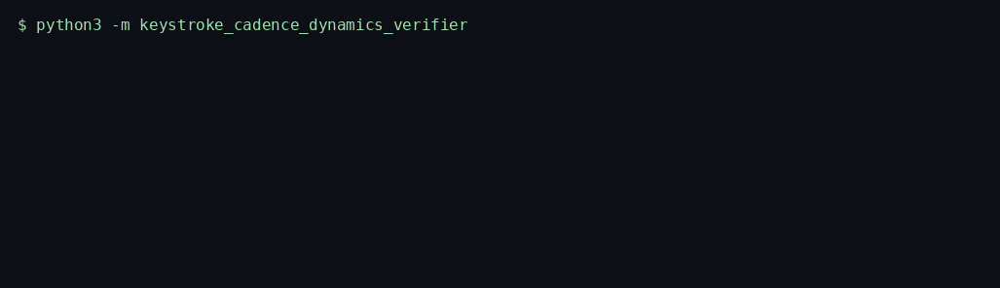
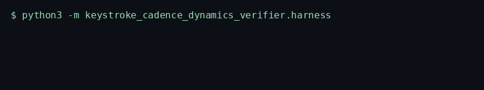
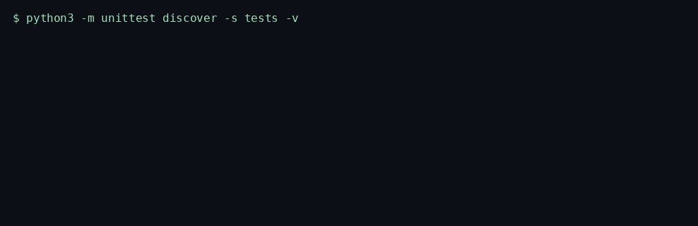

# Keystroke Cadence Dynamics Verifier

> Compares an opted-in dwell and flight template with dynamic time warping. It stores timings in milliseconds and no characters.

<p>
  <a href="https://github.com/TechieGoku2623/keystroke-cadence-dynamics-verifier/actions/workflows/ci.yml"></a>
  
  
</p>

| | |
| --- | --- |
| **Website** | https://github.com/TechieGoku2623/keystroke-cadence-dynamics-verifier |
| **Topics** | `python` `asyncio` `ecommerce` `fraud-detection` `behavioral-biometrics` |

## Walkthrough

### How it works


One real batch, in order: what went in, which gate fired, what came out.

Three recordings from this repository. Each one is the command in the frame, not a drawing.

### Engine

`python3 -m keystroke_cadence_dynamics_verifier`



Negative or multi-second gaps raise. A length mismatch or a zero-variance probe returns `reject` and does not update the template.

### Benchmark

`python3 -m keystroke_cadence_dynamics_verifier.harness`



5000 iterations after 20 warmup, seed 4401. Exact probe, DTW cost 0. The frame ends on the status line and `echo $?`.

### Tests

`python3 -m unittest discover -s tests -v`



Wire round-trip, the happy path, and both edge cases below.

## Pipeline

```
template dwell/flight ms
probe dwell/flight ms
  |
  v
bounds check
  |
  v
DTW absolute cost, banded window
z-distance vs template mean and pstdev
  |
  v
accept | step_up | reject
```

## Quick start

```bash
python3 -m venv venv
source venv/bin/activate
pip install -e ".[dev]"
python -m keystroke_cadence_dynamics_verifier
python -m keystroke_cadence_dynamics_verifier.harness
python -m unittest discover -s tests -v
```

Python 3.12. The runtime is the standard library. `black` and `flake8` are the `dev` extra.

## Use it

```python
import asyncio

from keystroke_cadence_dynamics_verifier import KeystrokeCadenceDynamicsVerifier


async def demo() -> None:
    verifier = KeystrokeCadenceDynamicsVerifier()
    dwell = [80.0, 120.0, 95.0, 110.0, 88.0, 130.0, 102.0, 115.0]
    flight = [40.0, 55.0, 35.0, 60.0, 42.0, 58.0, 37.0, 50.0]
    await verifier.run(
        [
            {"role": "template", "dwell_ms": dwell, "flight_ms": flight},
            {"role": "probe", "dwell_ms": dwell, "flight_ms": flight},
        ]
    )


asyncio.run(demo())
```

## Bounds

| | |
| --- | ---: |
| Iterations | 5000 |
| Average | 1440.577 µs |
| P99 | 1657.253 µs |
| tracemalloc peak | 263796 bytes |

Figures are from the harness on the machine that published them. A later host moves the microseconds. The pass/fail result does not.

## What it refuses

- A duration below 0 ms or above 2000 ms raises `EngineKernelException`. The template is left unchanged.
- A probe whose length differs from the template, or whose variance is zero, returns `decision=reject`.

Aligned with PCI DSS handling of account data by omission: no PAN and no keystroke characters cross this API.

## Tree

```
src/keystroke_cadence_dynamics_verifier/
  engine.py       kernel
  wire.py         struct frames
  harness.py      benchmark
  __main__.py     demo entry
tests/test_engine.py
Dockerfile        non-root, uid 10001
```
